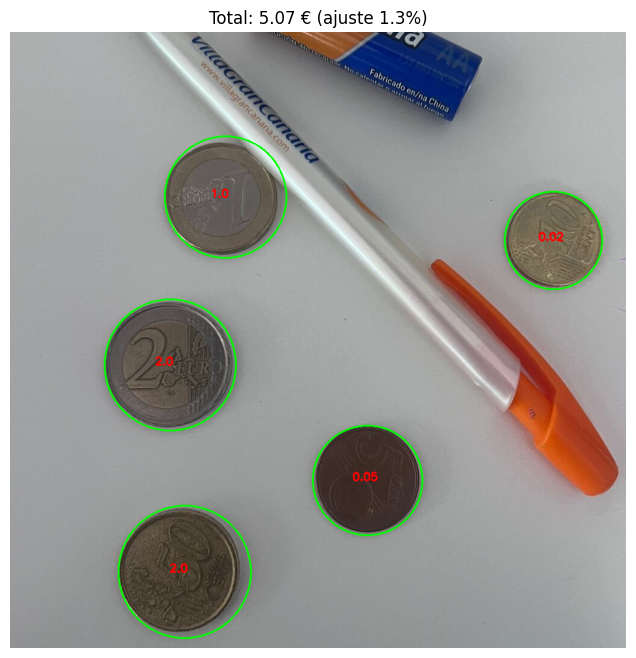

# Práctica 3: Detección y reconocimiento de formas

**Autores:**
- David Miranda Campos
- Alejandro Guerra Jimenez

## Índice

- [Práctica 3: Detección y reconocimiento de formas](#práctica-3-detección-y-reconocimiento-de-formas)
  - [Índice](#índice)
  - [Tarea 1: Estimación del Valor de Monedas](#tarea-1-estimación-del-valor-de-monedas)
    - [Objetivo](#objetivo)
    - [Metodología](#metodología)
    - [Resultados Tarea 1](#resultados-tarea-1)
  - [|  |  |](#----)
  - [Tarea 2: Clasificación de Microplásticos](#tarea-2-clasificación-de-microplásticos)
    - [Objetivo](#objetivo-1)
    - [Metodología](#metodología-1)
    - [Resultados Tarea 2](#resultados-tarea-2)
  - [Requisitos](#requisitos)
  - [Ejecución](#ejecución)

-----

## Tarea 1: Estimación del Valor de Monedas

### Objetivo

El reto consiste en procesar una imagen de monedas, identificar cada moneda y calcular la suma total de su valor. Se parte de la premisa de que no conocemos la escala de la imagen, por lo que el primer paso es calibrarla.

### Metodología

El proceso se divide en los siguientes pasos clave:

1.  **Calibración de Escala (px → mm):**

      * Para poder medir las monedas, primero necesitamos una referencia. El script permite al usuario **hacer clic sobre una moneda de 1 Euro** en la imagen.
      * Sabiendo que una moneda de 1€ tiene un diámetro real de **23.25 mm**, el script calcula su radio en píxeles y establece una **relación de conversión `px_a_mm`**.

2.  **Segmentación y Detección:**

      * La imagen se convierte a **escala de grises**.
      * Se aplica una **umbralización automática de Otsu** para binarizar la imagen, separando eficazmente las monedas del fondo.
      * Se utiliza `cv2.findContours` para detectar los contornos de todos los objetos segmentados.

3.  **Clasificación y Refinamiento:**

      * Se itera sobre cada contorno detectado, filtrando aquellos que son demasiado pequeños (ruido).
      * Para cada contorno válido, se calcula su diámetro en milímetros usando la escala previamente calibrada.
      * El diámetro medido se compara con una tabla de diámetros conocidos de monedas de euro para encontrar la coincidencia más cercana (menor error relativo).
      *  Para mejorar la precisión, se realiza un **ajuste iterativo**:
          * Se calcula el error relativo promedio de todas las monedas clasificadas inicialmente.
          * La escala `px_a_mm` se reajusta para minimizar este error promedio.
          * Se vuelven a clasificar todas las monedas con la escala refinada, obteniendo un resultado mucho más preciso.

4.  **Visualización de Resultados:**

      * Finalmente, se dibuja un círculo sobre cada moneda identificada, se etiqueta con su valor y se muestra el conteo total en el título de la imagen.

### Resultados Tarea 1

Como se puede observar, el algoritmo funciona de manera excelente en imágenes "ideales". Sin embargo, al enfrentarse a un escenario más realista como monedas_no_ideal.png, el método muestra sus limitaciones. Factores como sombras, brillos o la perspectiva de las monedas pueden alterar la medición precisa del diámetro. Esto provoca fallos en la clasificación, haciendo que el script detecte mal el valor de algunas de las monedas.

| Resultado 1 | Resultado 2 |
| :---: | :---: |
|  |  |
| Resultado 3 | Resultado 4 |
|  |  |
-----

## Tarea 2: Clasificación de Microplásticos

### Objetivo

El objetivo es desarrollar un clasificador propio, basado únicamente en **heurísticas geométricas y de apariencia**, para distinguir entre tres tipos de partículas de microplásticos en la imagen `MPs_test.jpg`:

  * **PEL**: Pellets (generalmente circulares y de color claro).
  * **TAR**: Partículas similares al alquitrán (oscuras e irregulares).
  * **FRA**: Fragmentos (el resto de formas y colores).

### Metodología

El enfoque para este problema es el siguiente:

1.  **Segmentación Avanzada:**

      * La imagen se convierte a **escala de grises** y se le aplica un **suavizado Gaussiano** para reducir el ruido.
      * Se utiliza un **umbral adaptativo (`adaptiveThreshold`)**, una técnica que funciona muy bien en imágenes con iluminación desigual, permitiendo segmentar partículas tanto en zonas claras como oscuras.
      * La imagen umbralizada se invierte y se binariza para que los contornos se puedan detectar correctamente.

2.  **Extracción de Características:**

      * Para cada contorno detectado, se extraen varias características clave que nos ayudarán a diferenciar los tipos de partículas:
          * **Circularidad:** Una métrica que tiende a 1 para círculos perfectos. Se calcula con la fórmula `(4 * π * Área) / (Perímetro^2)`.
          * **Relación de Aspecto:** La proporción entre la anchura y la altura del rectángulo que enmarca la partícula. Nos dice si es alargada o compacta.
          * **Intensidad Media de Gris:** El brillo promedio de los píxeles dentro del contorno. Nos ayuda a saber si la partícula es clara u oscura.

3.  **Clasificación Heurística (Basada en Reglas):**

      * Para evaluar la precisión del clasificador, se compararon las predicciones heurísticas (y_pred) con las etiquetas reales (y_true) extraídas de un CSV que contiene las coordenadas de los bounding boxes y la clase correcta de cada partícula.
      * Cada contorno detectado se asoció con su etiqueta real mediante la ubicación del centro del contorno dentro del rectángulo correspondiente en el CSV.
      * Se utilizó sklearn.metrics.confusion_matrix para generar la matriz de confusión, y ConfusionMatrixDisplay para visualizarla.

4. **Matriz de Confusión:**

   * Para evaluar la precisión del clasificador, se compararon las predicciones heurísticas (`y_pred`) con las etiquetas reales (`y_true`) extraídas de un CSV que contiene las coordenadas de los bounding boxes y la clase correcta de cada partícula.
   * Cada contorno detectado se asoció con su etiqueta real mediante la ubicación del centro del contorno dentro del rectángulo correspondiente en el CSV.
   * Se utilizó `sklearn.metrics.confusion_matrix` para generar la matriz de confusión, y `ConfusionMatrixDisplay` para visualizarla. 

### Resultados Tarea 2

El clasificador logra etiquetar con éxito una gran cantidad de partículas, mostrando cómo las características geométricas y de apariencia pueden ser muy efectivas para problemas de clasificación simples.


La matriz de confusión obtenida con el clasificador heurístico es la siguiente:


Interpretación:

* **PEL:** 17 correctamente clasificados, 16 confundidos con FRA.
* **TAR:** 8 correctamente clasificados, 1 confundido con PEL y 6 con FRA.
* **FRA:** 50 correctamente clasificados, 2 confundidos con PEL.

Esto muestra que el clasificador identifica bien los fragmentos (FRA), mientras que PEL y TAR presentan cierta confusión, especialmente con FRA.

En general, estas reglas heurísticas permiten un análisis rápido y comprensible de las partículas de microplásticos, y la matriz de confusión proporciona un método cuantitativo para evaluar su rendimiento.

-----

## Requisitos

Para ejecutar este notebook, necesitarás tener instaladas las siguientes librerías de Python:

```bash
pip install opencv-python
pip install numpy
pip install matplotlib
pip install scikit-learn
```

## Ejecución

1.  Asegúrate de tener todos los archivos de imagen (`monedas_no_ideal.png`, `MPs_test.jpg`) en el mismo directorio que el notebook.
2.  Abre el archivo `VC_P3.ipynb` en un entorno de Jupyter Notebook o JupyterLab.
3.  Ejecuta las celdas en orden.
4.  Para la Tarea 1, se abrirá una ventana de OpenCV. Haz clic en una moneda de 1 Euro y presiona cualquier tecla para continuar.