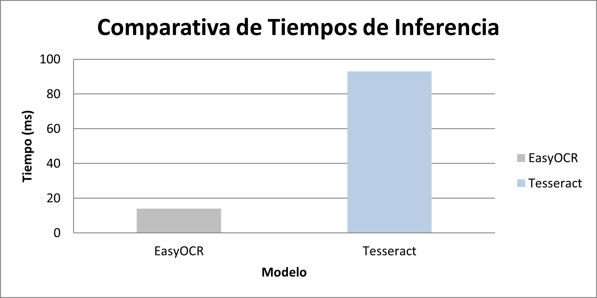
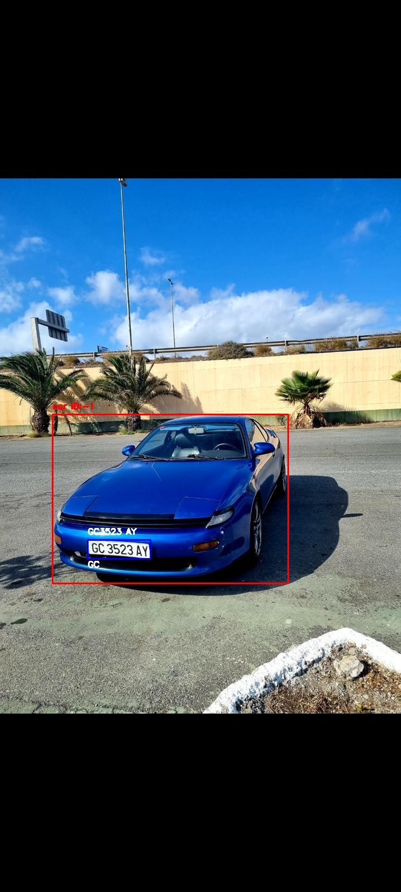
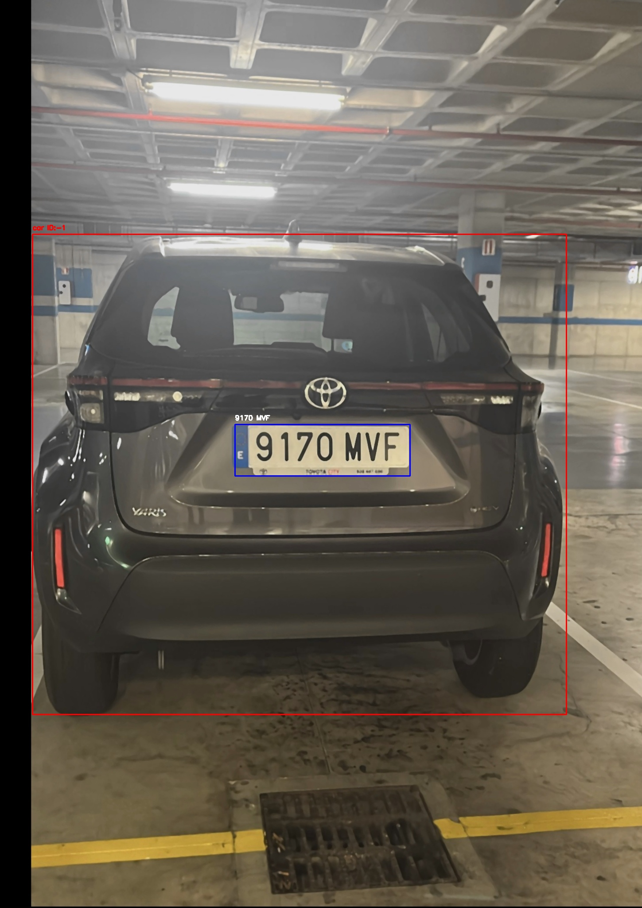

# Práctica 4 y 4B — Detección, Tracking y Reconocimiento de Matrículas

## Índice
- [Práctica 4: Detección de Personas, Coches y Matrículas](#práctica-4-detección-de-personas-coches-y-matrículas)
  - Objetivo
  - Tecnologías utilizadas
  - Preparación del entorno
  - Preparación y entrenamiento del modelo de matrículas (contornos + YOLO)
  - Resultados
- [Práctica 4B: Reconocimiento de Matrículas (OCR)](#práctica-4b-reconocimiento-de-matrículas-ocr)
  - Objetivo
  - Tecnologías utilizadas
  - Comparativa OCR (EasyOCR vs Tesseract)
  - Resultados
- [Archivos Generados](#archivos-generados)
- [Autores](#autores)

---

## Práctica 4: Detección de Personas, Coches y Matrículas

### Objetivo
El objetivo de la Práctica 4 es realizar la detección y seguimiento (tracking) de personas y coches en un vídeo, así como localizar las matrículas dentro de los vehículos.  
Se evaluaron dos enfoques para la localización de matrículas (contornos y YOLO) y, tras la evaluación, se seleccionó el basado en YOLO por ofrecer mejores resultados en las condiciones del vídeo utilizado.

### Tecnologías Utilizadas
| Tecnologías | Uso |
|--------------|------|
| Python + OpenCV | Procesamiento de vídeo, lectura y escritura de frames |
| YOLO11n (Ultralytics) | Detección y tracking de personas y coches |
| YOLO personalizado | Detección específica de matrículas |
| EasyOCR, Tesseract | OCR para reconocimiento de texto en matrículas |
| PyTorch | Aceleración por GPU para entrenamiento e inferencia |

---

### Preparación del Entorno

Se utilizaron tanto entornos basados en conda como entornos virtuales con pip. A continuación se incluyen instrucciones para ambos enfoques.

#### Opción A — Entorno con conda (recomendado para compatibilidad)
Crear un entorno conda con Python 3.9.5 (la versión usada en el desarrollo por compatibilidades):

```bash
conda create --name VC_P4 python=3.9.5 -y
conda activate VC_P4
```

Instalar ultralytics y dependencias básicas:

```bash
pip install ultralytics
pip install lap
```

Si `lap` presenta problemas, probar con:

```bash
pip install lapx
```

Instalación de PyTorch con soporte CUDA (ajustar la versión de CUDA a la disponible en el equipo). Ejemplo con CUDA 11.6:

```bash
conda install pytorch==1.12.1 torchvision==0.13.1 torchaudio==0.12.1 cudatoolkit=11.6 -c pytorch -c conda-forge
```

Instalaciones adicionales:

```bash
pip install opencv-python easyocr pytesseract pandas
```

Instalar Tesseract en el sistema (binario). En Windows se puede descargar desde la distribución de la Universidad de Mannheim; en Ubuntu:

```bash
sudo apt install tesseract-ocr
```

---

### Preparación y Entrenamiento del Modelo de Matrículas

Se consideraron y probaron dos métodos para localizar matrículas dentro del área del vehículo:

#### Método 2 — Detección mediante YOLO
Descripción:
- Entrenamiento de un detector YOLO específicamente para la clase `license_plate`.
- Estructura de dataset esperada por YOLO:
  - data/
    - train/images, train/labels
    - val/images, val/labels
    - test/images, test/labels
- Cada label en formato YOLO:
  ```
  <class_id> <x_center> <y_center> <width> <height>
  ```
Anotación:
- Herramienta recomendada: LabelImg o labelme. Se exportaron las anotaciones en formato YOLO.
División:
- Entrenamiento: 70-80%
- Validación: 10-20%
- Test: 10-20%

Entrenamiento:
- Entrenar en GPU:
```
yolo detect train model=yolo11n.pt data=data.yml imgsz=416 batch=4 device=0 epochs=20 workers=2
```

Resultados:
- Durante el entrenamiento se generaron carpetas `runs/detect/train/` con `best.pt` y `last.pt`.
- Se priorizó la selección del modelo `best.pt` con mayor `mAP50-95` y menor pérdida de validación.

---

### Resultados (Práctica 4)

**Salida generada por el prototipo:**

- Vídeo anotado con las detecciones y seguimiento de:
  - Personas (color de visualización configurable)
  - Vehículos
  - Matrículas detectadas dentro del vehículo correspondiente
- Se asigna un identificador de tracking a cada objeto para mantener el seguimiento a lo largo de los fotogramas.

**Archivo CSV generado:**

Incluye la información estructurada de cada detección. Ejemplo de columnas:

``` frame,tipo,conf,id,x1,y1,x2,y2,matricula_easy,matricula_tesseract,yolo_inference_time_s,easyocr_inference_time_s,tesseract_inference_time_s ```

**Aspectos adicionales considerados en la evaluación:**

- Comportamiento del tracking ante oclusiones parciales y cambios de escena.
- Conteo global de objetos detectados por clase en el vídeo de test.
- Comparación entre dos enfoques para la detección de matrículas:
  - Basado en análisis de contornos
  - Basado en un modelo YOLO entrenado específicamente

---

## Práctica 4B: Reconocimiento de Matrículas (OCR)

### Objetivo
Extender la Práctica 4 para extraer el texto de las matrículas detectadas y registrar la información en el CSV. Además se realiza una comparativa de rendimiento y acierto entre varios métodos OCR.

### Tecnologías utilizadas
| OCR | Descripción |
|-----|-------------|
| EasyOCR | OCR basado en redes neuronales, robusto en condiciones adversas |
| Tesseract OCR | OCR clásico, requiere preprocesado y filtrado por confianza |

---

### Proceso de reconocimiento

1. Para cada detección de coche:
   - Recortar la región de interés (ROI) del vehículo.
   - Aplicar el detector de matrículas (modelo YOLO) dentro del ROI y recortar la matrícula.
   - Preprocesado opcional (aumento de contraste, binarización, corrección de perspectiva).
2. EasyOCR:
   - Ejecutar `easy_reader.readtext(roi_matricula)` y tomar la mejor predicción.
3. Tesseract:
   - Convertir a RGB y ejecutar `pytesseract.image_to_data(...)`.
   - Filtrar resultados por confianza (por ejemplo > 60).
4. Guardar en CSV ambas lecturas y la caja de la matrícula.

---

### Comparativa OCR (EasyOCR vs Tesseract)

Criterios evaluados:
- Tasa de acierto sobre el conjunto de test anotado.
- Tiempo medio de inferencia por ROI.
- Robustez ante ruido, inclinación y baja iluminación.

Observaciones generales:
- EasyOCR mostró mayor robustez en la mayoría de las muestras del vídeo, con mejores resultados en condiciones de baja calidad.
- Tesseract resultó más sensible al preprocesado; filtrando por confianza (>60%) se redujeron falsos positivos.
- Dependiendo del caso de uso, una combinación de ambos (uso de EasyOCR por defecto y verificación con Tesseract) puede ofrecer un balance entre precisión y confiabilidad.

---

## Archivos Generados

| Archivo | Descripción |
|---------|-------------|
| resultado.mp4 | Vídeo anotado con detecciones y OCR |
| resultados.csv | CSV con resultados de detección, tracking y texto reconocido |
| runs/detect/... | Carpetas con resultados y pesos del entrenamiento de YOLO |

---


## Resultados Finales del OCR (Lectura de Matrículas)

A continuación se muestran los resultados obtenidos del video tras procesar el conjunto de matrículas con el sistema de reconocimiento OCR:

### Resultados por Matrícula

| Matrícula | Nº de Aciertos |
|-----------|----------------|
| 1423LKZ | 0 |
| 6713HCR | 0 |
| 2914FGN | 0 |
| 9786LCF | 0 |
| 0216HZN | 0 |
| 0053JFW | 0 |
| 0285FXZ | 0 |
| 3902FXD | 0 |
| 3685KMW | 0 |
| 9059LYY | 0 |
| 8536LKJ | 0 |

### Resumen de Resultados

- **Accuracy total:** 0%
- **Promedio Tiempo de inferencia YOLO (Vehículos):** 46.9 ms
- **Promedio Tiempo de inferencia EasyOCR:** 14 ms
- **Promedio Tiempo de inferencia Tesseract:** 93 ms


#### Grafica comparativa




#### Enlace al video resultado y a las imagenes en las que se ha probado el programa

- [Video Resultado](resultado/resultado.mp4)

| Primera foto | Segunda foto |
|--------------|--------------|
|  |  |


*El sistema logra reconocer las matriculas en imagenes estaticas y con buenas condiciones pero falla en el video a la hora de reconocer la matricula en los diferentes frames*

#### Dataset Utilizado
- [Dataset](https://alumnosulpgc-my.sharepoint.com/:u:/g/personal/david_miranda103_alu_ulpgc_es/ERRp0TXzQghLgA5V0csTYIgBvxB-49p1A7K-Y7Uku1iPDQ?e=Nn266R)

## Autores
- David Miranda Campos
- Alejandro Guerra Jiménez

Universidad de Las Palmas de Gran Canaria
Visualización por Computador

---